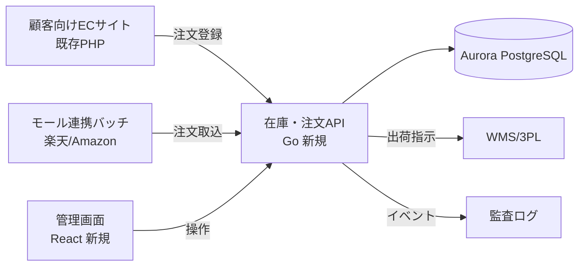

# 要件定義書 — 在庫・注文管理API基盤

| 項目 | 内容 |
| --- | --- |
| バージョン | 1.0 |
| 作成日 | 2026-05-20 |
| 承認 | ミナトマート 情報システム部 / 開発ベンダー PM |
| 関連文書 | [00-rfp.md](00-rfp.md), [02-domain-model.md](02-domain-model.md), [05-architecture.md](05-architecture.md) |

## 1. システム全体像

既存PHPモノリスから在庫・注文の中核ロジックを切り出し、Goで実装した新APIに集約する。
既存モノリスは決済とECサイト表示のみを担い、在庫・注文の問い合わせは新APIを呼ぶ。

## 2. 登場する利用者（アクター）

| アクター | 説明 | 主な操作 |
| --- | --- | --- |
| 一般顧客 | ECサイト利用者。APIを直接叩かない | 注文（ECサイト経由） |
| オペレーター | 受注・出荷担当。25名 | 注文検索、出荷指示、キャンセル、在庫調整 |
| 管理者 | 情報システム部。5名 | 上記すべて＋商品マスタ編集、在庫の強制補正 |
| 外部システム | ECサイト、モール連携バッチ | 注文登録、在庫照会 |

## 3. 機能要件

### 3.1 商品・SKU管理（FR-100番台）

| ID | 機能 | 内容 | 優先度 |
| --- | --- | --- | --- |
| FR-101 | 商品登録 | 商品名・説明・カテゴリを登録する。1商品は1件以上のSKUを持つ | 必須 |
| FR-102 | SKU登録 | SKUコード・価格・サイズ/色などのバリエーションを登録する | 必須 |
| FR-103 | 商品一覧・検索 | 商品名、SKUコード、カテゴリで検索し、ページングして返す | 必須 |
| FR-104 | 商品詳細取得 | 商品と紐づくSKU、各拠点の在庫数を返す | 必須 |
| FR-105 | 商品の販売停止 | 論理削除。停止中SKUは新規注文を受け付けない | 必須 |
| FR-106 | 商品一括登録 | CSVによる一括登録・更新 | 希望 |

### 3.2 在庫管理（FR-200番台）

| ID | 機能 | 内容 | 優先度 |
| --- | --- | --- | --- |
| FR-201 | 在庫照会 | SKU×拠点の「実在庫数」「引当済数」「引当可能数」を返す | 必須 |
| FR-202 | 在庫引当 | 注文確定時にSKU×拠点の在庫を引き当てる。引当可能数を超える場合は失敗させる | 必須 |
| FR-203 | 引当解除 | 注文キャンセル時に引当を戻す | 必須 |
| FR-204 | 出庫確定 | 出荷完了時に引当を実在庫から減算し、引当を消し込む | 必須 |
| FR-205 | 入荷登録 | 仕入・返品による実在庫の増加を登録する | 必須 |
| FR-206 | 在庫補正 | 棚卸差異の補正。理由コードとメモの入力を必須とする（管理者のみ） | 必須 |
| FR-207 | 在庫履歴照会 | SKU×拠点の在庫変動履歴を時系列で返す | 必須 |
| FR-208 | 在庫アラート | 引当可能数が閾値を下回ったSKUを一覧化する | 希望 |

### 3.3 注文管理（FR-300番台）

| ID | 機能 | 内容 | 優先度 |
| --- | --- | --- | --- |
| FR-301 | 注文登録 | チャネル・顧客情報・明細を受け取り、在庫引当と同時に注文を作成する | 必須 |
| FR-302 | 冪等な注文登録 | 同一の冪等キーによる再送は、重複作成せず初回結果を返す | 必須 |
| FR-303 | 注文検索 | 注文番号、顧客名、ステータス、期間、チャネルで検索する | 必須 |
| FR-304 | 注文詳細取得 | 明細、金額、配送先、状態遷移履歴を返す | 必須 |
| FR-305 | 出荷指示 | 注文を出荷指示済にし、WMSへ連携する | 必須 |
| FR-306 | 出荷完了 | WMSからの通知を受けて出荷済にし、出庫を確定する | 必須 |
| FR-307 | 注文キャンセル | 未出荷の注文をキャンセルし、引当を解除する。理由の入力を必須とする | 必須 |
| FR-308 | 部分キャンセル | 明細単位でのキャンセル | 希望 |
| FR-309 | 状態遷移履歴 | すべての状態変更を、実行者・日時・理由とともに記録し照会できる | 必須 |

### 3.4 チャネル管理（FR-400番台）

| ID | 機能 | 内容 | 優先度 |
| --- | --- | --- | --- |
| FR-401 | チャネル登録 | 販売チャネルを設定として追加する（コード変更を伴わないこと） | 必須 |
| FR-402 | チャネル別在庫配分 | チャネルごとに引当可能数の上限を設定する | 希望 |

### 3.5 認証・権限（FR-500番台）

| ID | 機能 | 内容 | 優先度 |
| --- | --- | --- | --- |
| FR-501 | 職員ログイン | メールアドレスとパスワードで管理画面にログインする | 必須 |
| FR-502 | ロール権限 | オペレーター／管理者の2ロール。在庫補正と商品編集は管理者のみ | 必須 |
| FR-503 | APIキー認証 | 外部システム（EC・モール連携）はAPIキーで認証する | 必須 |
| FR-504 | 監査ログ | 誰がどのAPIを叩いたかを記録し、90日保持する | 必須 |

## 4. 非機能要件

| ID | 分類 | 要件 | 検証方法 |
| --- | --- | --- | --- |
| NFR-01 | 性能 | 注文登録API：50 req/s で p95 ≤ 300ms | 負荷試験（k6） |
| NFR-02 | 性能 | 一覧系API：p95 ≤ 500ms（1ページ50件） | 負荷試験 |
| NFR-03 | 整合性 | 同一SKUへの同時引当で売り越しが発生しないこと | 並行実行テスト |
| NFR-04 | 可用性 | 稼働率 99.9%（月間ダウンタイム43分以内） | 監視ダッシュボード |
| NFR-05 | 拡張性 | チャネル追加が設定のみで完了すること | 受入テストで実演 |
| NFR-06 | セキュリティ | 個人情報を含むレスポンスはロールに応じてマスクする | 権限テスト |
| NFR-07 | 運用 | 主要な業務エラーはアラート通知される（Slack） | 障害訓練 |
| NFR-08 | 保守 | バックエンドのユニットテストカバレッジ 70% 以上 | CIで計測 |
| NFR-09 | 移行 | 既存12,000 SKU・過去2年分の注文を移行し、件数と金額が一致すること | 移行リハーサル |

## 5. 用語の定義

| 用語 | 定義 |
| --- | --- |
| 実在庫数 | 倉庫に物理的に存在する数量 |
| 引当済数 | 注文に紐づいて確保済みだが、まだ出庫していない数量 |
| 引当可能数 | 実在庫数 − 引当済数。新規注文が引き当てられる数量 |
| 引当 | 注文に対して在庫を確保する操作 |
| 出庫確定 | 出荷に伴い実在庫と引当済数の両方を減らす操作 |
| 売り越し | 引当可能数を超えて注文を受けてしまうこと |
| チャネル | 販売経路。自社EC、楽天市場、Amazon など |
| 拠点 | 在庫を保管する場所。自社倉庫、3PL倉庫 |

## 6. 前提と制約

- 拠点をまたぐ在庫引当は行わない（RFP Q4）。注文は単一拠点で完結する
- バックオーダー（在庫切れ時の予約受付）はフェーズ1では扱わない（RFP Q3）
- 決済処理は既存モノリスの責務。本APIは決済ステータスを参照しない
- 為替・多通貨は扱わない。通貨は日本円のみ

## 7. 未決事項

| # | 内容 | 期限 | 担当 |
| --- | --- | --- | --- |
| O-1 | 在庫アラートの閾値をSKU単位で持つか、カテゴリ単位で持つか | 詳細設計時 | クライアント |
| O-2 | WMS連携のインターフェース仕様（CSV/API）の最終確定 | 2026-07 | 双方 |
| O-3 | 監査ログの保持期間90日で法務要件を満たすか | 2026-06 | クライアント法務 |
| O-4 | 全SKUが販売停止の商品を、管理画面の一覧でどう扱うか | MIN-011 着手前 | クライアント |
| O-5 | 販売停止した商品・SKUを再開できる必要があるか | MIN-006c 着手前 | クライアント |

### O-4 の詳細

商品が `active` でも、配下のSKUがすべて `suspended` なら、実際には1件も注文できない。
このとき商品一覧（FR-103）で「販売中」として表示されると、
**オペレーターから見て「販売中なのに注文が通らない商品」**が存在することになる。

想定される選択肢:

| 案 | 内容 |
| --- | --- |
| A | そのまま「販売中」として表示する（現状の仕様どおり） |
| B | 「販売可能なSKUなし」の警告を併記する |
| C | 既定の一覧から除外し、絞り込みでのみ表示する |

なお `Product` と `SKU` の status を分けて持つこと自体は変更しない。
「商品の取り扱いをやめた」と「バリエーションが全部廃番」は意図が異なり、
後者は新SKUを追加すればすぐ販売再開できる状態のため（[02-domain-model.md](02-domain-model.md) 2章）。

### O-5 の詳細

FR-105 は「商品の販売停止（論理削除）」だけを定義しており、**停止からの復帰に触れていない。**
ドメイン層（MIN-006b）でも `Suspend()` のみ実装し、`Activate()` は保留にしている。

季節商品の一時停止や、誤操作による停止の取り消しが業務として起きるなら再開操作が要る。
一方「停止＝取り扱い終了」の運用であれば、再開できないほうが事故が減る。
どちらの運用かはクライアントに確認しないと決められない。

想定される選択肢:

| 案 | 内容 |
| --- | --- |
| A | 再開は提供しない。停止は不可逆とし、再販時は新規登録で対応する |
| B | admin ロール限定で再開可能にする |
| C | operator も再開可能にする |

B・C を採る場合は、誰がいつ再開したかを追えるようにするか（FR-504 監査ログ）、
`Order.Status` と同様に履歴を持たせるか（FR-309 と同じ形にするか）を併せて決める必要がある。
