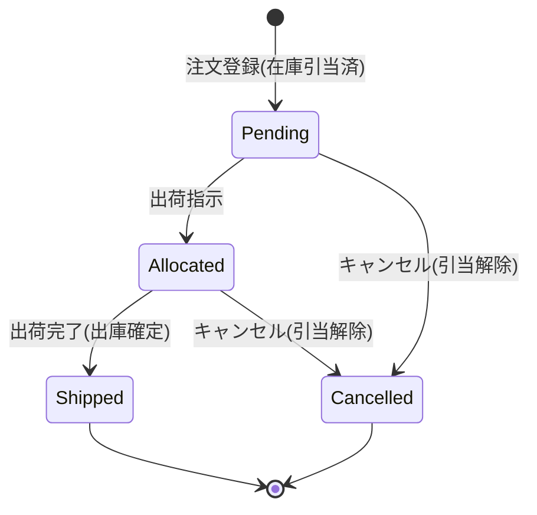

# ドメインモデル

関連: [01-requirements.md](01-requirements.md) / [03-erd.md](03-erd.md) / [adr/0002-inventory-concurrency.md](adr/0002-inventory-concurrency.md)

## 1. 集約の切り方

このシステムの肝は「在庫の売り越しをゼロにする」（R-01）ことにある。
そのため **在庫（Inventory）と注文（Order）を別々の集約とし、在庫側に整合性の責任を寄せる**。

| 集約 | 集約ルート | 不変条件 |
| --- | --- | --- |
| Product | Product | SKUを1件以上持つ。SKUコードは全体で一意 |
| Inventory | InventoryItem (SKU×拠点) | `onHand >= reserved >= 0` を常に満たす |
| Order | Order | 明細を1件以上持つ。状態遷移は定義された経路のみ |

**注文と在庫をまたぐ操作（引当を伴う注文作成）は、ひとつのDBトランザクションで実行する。**
将来サービス分割する場合はSagaに置き換える余地を残すが、フェーズ1では単一DBの強整合を選ぶ。
判断の経緯は [ADR-0002](adr/0002-inventory-concurrency.md) を参照。

## 2. Product 集約

```
Product
├─ id: ProductID
├─ name: string
├─ description: string
├─ categoryID: CategoryID
├─ status: active | suspended        // suspended は新規注文を受け付けない
└─ skus: []SKU (1..*)
      ├─ id: SKUID
      ├─ code: SKUCode               // 全体で一意。例 "MM-TOWEL-BL-M"
      ├─ price: Money                // 日本円。税抜
      ├─ attributes: map[string]string  // {"color":"blue","size":"M"}
      └─ status: active | suspended
```

- `Product.status = suspended` にすると、配下の全SKUが実質的に販売停止になる
- SKU単体の販売停止も可能（在庫はあるが売らない、というケース）

## 3. Inventory 集約

```
InventoryItem                        // 一意キー: (skuID, locationID)
├─ skuID: SKUID
├─ locationID: LocationID
├─ onHand: int                       // 実在庫数
├─ reserved: int                      // 引当済数
└─ version: int                       // 楽観ロック用

  available() = onHand - reserved     // 引当可能数
```

### 不変条件

1. `onHand >= 0`
2. `reserved >= 0`
3. `reserved <= onHand` — 引当済が実在庫を超えることはない
4. `available() >= 0` — 3 から自動的に導かれる

### 状態を変える操作

| 操作 | 前提 | onHand | reserved | 発生タイミング |
| --- | --- | --- | --- | --- |
| `Reserve(qty)` | `available() >= qty` | 変化なし | `+qty` | 注文確定 (FR-202) |
| `Release(qty)` | `reserved >= qty` | 変化なし | `-qty` | 注文キャンセル (FR-203) |
| `Ship(qty)` | `reserved >= qty` | `-qty` | `-qty` | 出荷完了 (FR-204) |
| `Receive(qty)` | `qty > 0` | `+qty` | 変化なし | 入荷 (FR-205) |
| `Adjust(delta, reason)` | 結果が不変条件を満たす | `+delta` | 変化なし | 棚卸補正 (FR-206) |

すべての操作は `InventoryMovement`（在庫変動履歴）を1件生成する。履歴は追記のみで、更新・削除しない。

### 具体例

SKU `MM-TOWEL-BL-M` が拠点 `WH-TOKYO` に 実在庫10・引当0 で存在するとき:

```
初期状態         onHand=10, reserved=0,  available=10
注文A(3個)引当 → onHand=10, reserved=3,  available=7
注文B(8個)引当 → available(7) < 8 なので失敗 ★ここで売り越しを防ぐ
注文A出荷完了  → onHand=7,  reserved=0,  available=7
棚卸で1個不足  → onHand=6,  reserved=0,  available=6  (reason: STOCKTAKING_LOSS)
```

## 4. Order 集約

```
Order
├─ id: OrderID
├─ orderNumber: string                // 顧客提示用。例 "MM-20260601-000123"
├─ channelCode: ChannelCode           // 設定で追加可能 (FR-401)
├─ locationID: LocationID             // 単一拠点で完結する
├─ status: OrderStatus
├─ customer: CustomerInfo             // 氏名/電話/メール ※個人情報
├─ shippingAddress: Address           // ※個人情報
├─ idempotencyKey: string             // 冪等キー (FR-302)
├─ lines: []OrderLine (1..*)
│     ├─ skuID / skuCode              // skuCodeは注文時点の値を保持（スナップショット）
│     ├─ quantity: int
│     └─ unitPrice: Money             // 注文時点の価格を保持
├─ totalAmount: Money                 // = Σ(unitPrice × quantity)
└─ history: []StatusChange            // 追記のみ (FR-309)
      ├─ from / to: OrderStatus
      ├─ changedBy: ActorID
      ├─ changedAt: time
      └─ reason: string
```

**価格とSKUコードは注文時点の値をコピーして保持する。** マスタが後から変わっても過去の注文は変わらない。

### 状態遷移



| 状態 | 意味 | 在庫の状態 |
| --- | --- | --- |
| `pending` | 受付済。出荷準備待ち | 引当済 |
| `allocated` | 出荷指示済。WMSへ連携済 | 引当済 |
| `shipped` | 出荷完了 | 出庫確定（実在庫から減算済） |
| `cancelled` | キャンセル | 引当解除済 |

**`shipped` からの遷移は無い。** 返品はフェーズ1のスコープ外で、入荷登録(FR-205)で吸収する。

### 遷移の禁止事項

- `shipped` → `cancelled` は不可（出荷済のものはキャンセルできない）
- `cancelled` からのすべての遷移は不可
- 同じ状態への遷移は不可（`pending` → `pending` はエラー）

## 5. ドメインイベント

フェーズ1では同一プロセス内のハンドラで処理するが、将来の非同期化に備えて名前を定義しておく。

| イベント | 発生元 | 用途 |
| --- | --- | --- |
| `OrderPlaced` | Order | 監査ログ、モール側への在庫連携 |
| `OrderCancelled` | Order | 監査ログ、引当解除 |
| `OrderShipped` | Order | 監査ログ、出庫確定 |
| `StockLow` | Inventory | 在庫アラート (FR-208) |

## 6. ユビキタス言語（コード上の名前）

要件定義の用語をコードでどう表記するかを固定する。

| 日本語 | コード上の名前 | 使ってはいけない別名 |
| --- | --- | --- |
| 実在庫数 | `OnHand` | `stock`, `quantity` |
| 引当済数 | `Reserved` | `allocated`, `held` |
| 引当可能数 | `Available` | `free`, `sellable` |
| 引当 | `Reserve` | `allocate`, `hold` |
| 引当解除 | `Release` | `unreserve`, `cancel` |
| 出庫確定 | `Ship` | `dispatch`, `commit` |
| 拠点 | `Location` | `warehouse`, `site` |
| チャネル | `Channel` | `source`, `marketplace` |

「引当」に `allocate` を使わないのは、注文ステータスの `allocated`（出荷指示済）と紛らわしいため。
