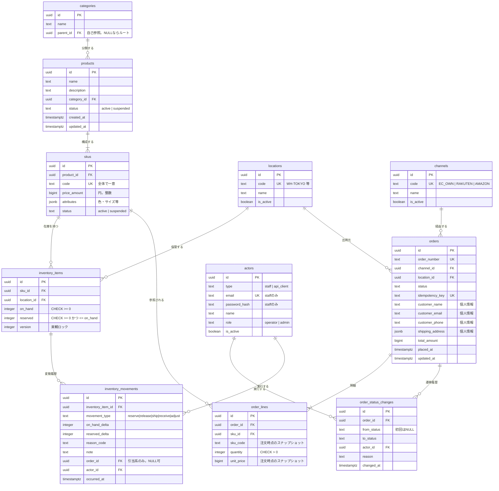

# ER設計

関連: [02-domain-model.md](02-domain-model.md) / マイグレーション: `backend/migrations/`

## 1. ER図



## 2. 設計上の決定と理由

### 2.1 金額を `bigint`（整数の円）で持つ

`numeric` や浮動小数点を使わない。日本円は最小単位が1円で小数を持たないため、
整数で保持すれば丸め誤差の考慮そのものが不要になる。
将来多通貨対応する場合は `currency` カラムと最小単位の指数を追加する。

### 2.2 在庫の不変条件をDB制約に落とす

```sql
CHECK (on_hand >= 0)
CHECK (reserved >= 0)
CHECK (reserved <= on_hand)
```

アプリ側でも検証するが、**DB側にも置く**。
バッチ処理や手動SQLなどアプリを経由しない経路があっても、売り越し状態のデータが物理的に作れなくなる。
R-01（売り越しゼロ）に対する最後の防波堤。

### 2.3 `inventory_items` に一意制約

```sql
UNIQUE (sku_id, location_id)
```

SKU×拠点の在庫レコードが重複すると、引当可能数の計算が二重になって破綻する。

### 2.4 履歴テーブルは追記のみ

`inventory_movements` と `order_status_changes` は INSERT のみ。
UPDATE/DELETE をアプリから発行しない。R-02（全変更の追跡）を満たすため。
運用上も、これらのテーブルには専用DBロールから UPDATE/DELETE 権限を与えない。

### 2.5 注文明細に `sku_code` と `unit_price` をコピー

正規化の原則からは冗長だが、意図的にコピーする。
商品マスタの価格が改定されても、過去の注文金額が変わってはならない。
`sku_id` の外部キーは残すので、現在の商品情報への参照もたどれる。

### 2.6 冪等キーを一意制約で守る

```sql
UNIQUE (idempotency_key)
```

FR-302。アプリ側で「既存チェック→なければ作成」とすると競合時に二重作成が起きる。
一意制約違反を捕まえて既存の注文を返す実装にする（詳細は [ADR-0003](adr/0003-idempotency.md)）。

## 3. 主なインデックス

| テーブル | インデックス | 理由 |
| --- | --- | --- |
| `skus` | `UNIQUE (code)` | SKUコード検索 (FR-103) |
| `products` | `(category_id, status)` | カテゴリ絞り込み |
| `inventory_items` | `UNIQUE (sku_id, location_id)` | 引当時の一意特定 |
| `inventory_movements` | `(inventory_item_id, occurred_at DESC)` | 履歴照会 (FR-207) |
| `orders` | `UNIQUE (order_number)` | 注文番号検索 (FR-303) |
| `orders` | `UNIQUE (idempotency_key)` | 冪等性 (FR-302) |
| `orders` | `(status, placed_at DESC)` | ステータス別一覧 |
| `orders` | `(channel_id, placed_at DESC)` | チャネル別集計 |
| `order_lines` | `(order_id)` | 明細取得 |
| `order_status_changes` | `(order_id, changed_at)` | 遷移履歴 (FR-309) |

`orders.customer_name` の部分一致検索（FR-303）は、件数が増えたら `pg_trgm` の GIN インデックスを検討する。
フェーズ1では前方一致で実装し、負荷試験の結果を見て判断する。

## 4. データ量の見積もり

| テーブル | 初期 | 年間増加 | 3年後 |
| --- | --- | --- | --- |
| `products` | 3,000 | +600 | 4,800 |
| `skus` | 12,000 | +2,400 | 19,200 |
| `inventory_items` | 24,000 | +4,800 | 38,400 |
| `orders` | 1,460,000（過去2年移行） | +900,000 | 4,160,000 |
| `order_lines` | 3,800,000 | +2,300,000 | 10,700,000 |
| `inventory_movements` | 0 | +5,000,000 | 15,000,000 |

`inventory_movements` が最も増える。3年で1,500万行。
`occurred_at` によるレンジパーティションを将来の選択肢として想定しておく（フェーズ1では単一テーブル）。
