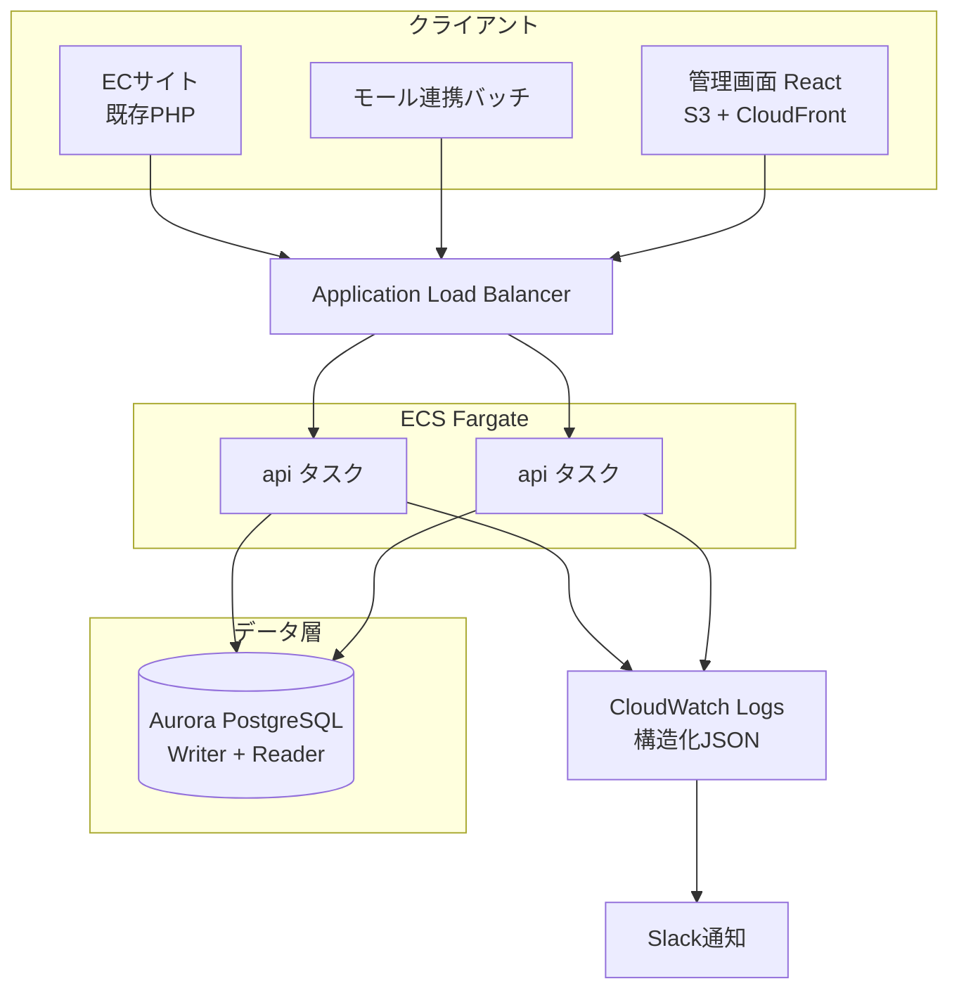

# アーキテクチャ設計

関連: [01-requirements.md](01-requirements.md) / [02-domain-model.md](02-domain-model.md) / [adr/](adr/)

## 1. 全体構成（AWS）



- APIタスクは最小2・最大8でオートスケール（CPU 60% 閾値）
- セール時は事前にタスク数の下限を引き上げる（ピークが1ヶ月前に確定するため / RFP Q1）
- 一覧系の重いクエリのみ Reader エンドポイントに向ける

## 2. バックエンドのレイヤ構成

依存の向きを内側（ドメイン）に固定する。ドメイン層は他のどの層にも依存しない。

```
backend/
├── cmd/api/                     エントリポイント。DIと起動のみ
└── internal/
    ├── domain/                  ★ 依存なし。ビジネスルールの本体
    │     inventory.go             InventoryItem と Reserve/Release/Ship/Receive/Adjust
    │     order.go                 Order と状態遷移ルール
    │     product.go               Product / SKU
    │     errors.go                ドメインエラーの定義
    ├── usecase/                 ユースケース。トランザクション境界を持つ
    │     place_order.go           注文登録（引当を含む）
    │     cancel_order.go
    │     ship_order.go
    │     ports.go                 リポジトリのインターフェース定義
    ├── adapter/
    │     httpapi/               HTTPハンドラ。JSON⇔ユースケース入出力の変換
    │     postgres/              リポジトリ実装。SQLはここだけに書く
    └── platform/
          config/                環境変数の読み込み
```

### 依存の向き

```
httpapi ──▶ usecase ──▶ domain
postgres ──▶ usecase(ports) ──▶ domain
```

`usecase` はリポジトリを**インターフェースとして** `ports.go` に定義し、`postgres` がそれを実装する。
これにより、ユースケースのテストはDBなしで書ける。

### 各層の責務

| 層 | やること | やらないこと |
| --- | --- | --- |
| `domain` | 不変条件の検証、状態遷移の可否判定 | DB、HTTP、ログ、時刻の取得 |
| `usecase` | 複数の集約をまたぐ手続き、トランザクション境界 | SQLを書く、HTTPステータスを決める |
| `httpapi` | リクエスト検証、ドメインエラー→HTTPステータス変換 | ビジネスルールの判断 |
| `postgres` | SQL、トランザクション実行 | ビジネスルールの判断 |

**「在庫が足りなければエラー」という判断を `postgres` や `httpapi` に書かない。** `domain` に置く。
レビュー時に最も注意して見る点。

## 3. 主要な技術選定

| 領域 | 選定 | 理由 |
| --- | --- | --- |
| 言語 | Go 1.26 | RFPの制約。並行処理と静的バイナリ配布 |
| HTTPルータ | `net/http` (標準) | Go 1.22+ のパターンルーティングで十分。依存を減らす |
| DBドライバ | `pgx/v5` | PostgreSQL特化。`database/sql` より高速で型が扱いやすい |
| SQL | 手書き（ORMなし） | 在庫更新で `FOR UPDATE` など細かい制御が要る。ORMだと隠れる |
| マイグレーション | `golang-migrate` | 上り下り両方のSQLを明示的に書く |
| ログ | `log/slog` (標準) | 構造化JSON。CloudWatch Logs Insights で検索する |
| テスト | 標準 `testing` + `testcontainers` | ユニットはモック、リポジトリは実DBで検証 |
| フロント | React 19 + TypeScript + Vite | RFPの制約 |
| フロント状態管理 | TanStack Query | 管理画面はサーバー状態が主。グローバル状態は最小 |
| フロントUI | Tailwind CSS | 社内向けでデザイン要求が高くない。速度優先 |

## 4. 在庫引当の並行制御

R-01（売り越しゼロ）と NFR-03 を満たす中核部分。詳細は [ADR-0002](adr/0002-inventory-concurrency.md)。

方針は**悲観ロック（`SELECT ... FOR UPDATE`）**。

```
BEGIN;
  -- 注文明細のSKUを ID昇順にソートしてロック（デッドロック回避）
  SELECT * FROM inventory_items
   WHERE (sku_id, location_id) IN (...)
   ORDER BY id
   FOR UPDATE;

  -- ドメイン層で available() >= qty を検証
  -- 不足があればここでロールバック

  UPDATE inventory_items SET reserved = reserved + $1 WHERE id = $2;
  INSERT INTO inventory_movements (...);
  INSERT INTO orders (...), order_lines (...), order_status_changes (...);
COMMIT;
```

**ロック順序を `id` 昇順に固定する**のが重要。
注文Aが SKU1→SKU2、注文Bが SKU2→SKU1 の順にロックするとデッドロックする。

## 5. エラーの扱い

ドメインエラーを型で定義し、HTTP層で1箇所だけマッピングする。

| ドメインエラー | HTTPステータス | エラーコード |
| --- | --- | --- |
| `ErrInsufficientStock` | 409 Conflict | `INSUFFICIENT_STOCK` |
| `ErrInvalidStatusTransition` | 409 Conflict | `INVALID_STATUS_TRANSITION` |
| `ErrNotFound` | 404 Not Found | `NOT_FOUND` |
| `ErrValidation` | 400 Bad Request | `VALIDATION_ERROR` |
| `ErrForbidden` | 403 Forbidden | `FORBIDDEN` |
| その他 | 500 | `INTERNAL_ERROR` |

レスポンス形式はすべて共通。

```json
{
  "error": {
    "code": "INSUFFICIENT_STOCK",
    "message": "在庫が不足しています",
    "details": [
      { "skuCode": "MM-TOWEL-BL-M", "requested": 8, "available": 7 }
    ]
  }
}
```

**500系のレスポンスに内部情報を含めない。** SQLエラーの原文などはログにのみ出す。

## 6. 観測性

| 種別 | 内容 |
| --- | --- |
| ログ | 構造化JSON。全リクエストに `request_id` を付与し、ログとレスポンスヘッダの両方に出す |
| メトリクス | リクエスト数・レイテンシ・エラー率をエンドポイント別に。`/metrics` で Prometheus 形式 |
| 業務メトリクス | 在庫不足による注文失敗数、キャンセル数、引当可能数がマイナスのレコード数（常に0のはず） |
| アラート | 5xx率 1%超（5分）、p95 500ms超（10分）、在庫不変条件違反の検知（即時） |

「引当可能数がマイナスのレコード数」を監視するのは、R-01が破れたことを即座に知るため。
DB制約で防いでいるので理論上0だが、**0であることを監視する**。
