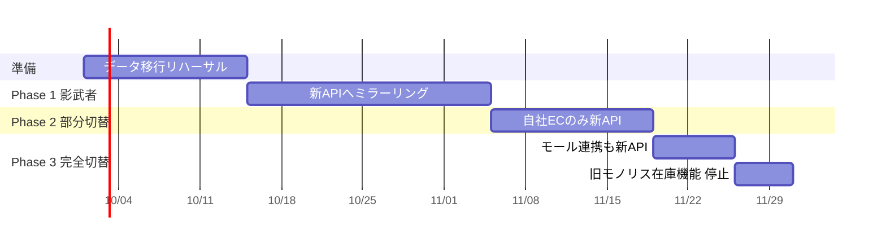

# 運用・保守設計

対象期間: 本番稼働後6ヶ月（RFP 想定期間）
関連: [05-architecture.md](05-architecture.md) 6章（観測性）

## 1. 移行計画（R-05：並行稼働）

一度に切り替えない。3段階で移す。



| フェーズ | 内容 | 判定基準 | 切り戻し |
| --- | --- | --- | --- |
| Phase 1 | 既存モノリスへの注文を新APIにも複製（新API側の結果は使わない） | 7日間、旧新の在庫数が全SKUで一致 | ミラーを止めるだけ |
| Phase 2 | 自社ECの注文を新APIが正とする。モールは旧のまま | 14日間、売り越し0件・p95 300ms以内 | ECの向き先を旧に戻す（設定変更のみ、5分） |
| Phase 3 | モール連携も新APIへ。旧の在庫機能を停止 | 7日間、全チャネルで問題なし | Phase 2 の状態に戻す |

**Phase 1 が最も重要。** 実トラフィックで在庫計算が旧システムと一致することを、
リスクゼロで検証できる唯一の機会。ここを短縮しない。

### データ移行の検証項目（NFR-09）

| 項目 | 検証方法 | 合格基準 |
| --- | --- | --- |
| SKU件数 | 旧新の COUNT 比較 | 完全一致（12,000件） |
| 在庫数 | SKU×拠点ごとの on_hand 比較 | 全件一致 |
| 注文件数 | 過去2年の COUNT | 完全一致 |
| 注文金額 | 月次の SUM(total_amount) 比較 | 全月一致（1円の差も不可） |
| ステータス分布 | ステータス別件数 | 一致 |

金額が1円でも違えば移行失敗として扱う。丸め処理の差異を見逃さないため。

## 2. 監視とアラート

| # | 監視項目 | 閾値 | 重大度 | 一次対応 |
| --- | --- | --- | --- | --- |
| A-01 | 引当可能数が負のレコード数 | 1件以上 | **緊急** | 該当SKUの販売停止 → 調査 |
| A-02 | 5xx エラー率 | 5分平均で1%超 | 緊急 | ログ確認 → 直近デプロイの切り戻し |
| A-03 | 注文登録API p95 | 10分平均で500ms超 | 重要 | DB接続数・スロークエリ確認 |
| A-04 | ヘルスチェック失敗 | 連続3回 | 緊急 | タスク再起動 |
| A-05 | DB接続プール枯渇 | 使用率90%超 | 重要 | 接続数上限の確認 |
| A-06 | 在庫不足による注文失敗数 | 通常時の3倍 | 注意 | 在庫補充の要否をクライアントへ連絡 |
| A-07 | ロック待ちタイムアウト | 1件以上 | 重要 | 該当トランザクションの特定 |
| A-08 | 冪等キー重複かつ内容相違 | 1件以上 | 注意 | クライアント実装の確認 |

A-01 は R-01 が破れたことを意味する。DB制約で防いでいるので発火しないはずだが、
**発火しないことを確認し続ける**のが監視の目的。

### 通知先

| 重大度 | 通知先 | 対応時間 |
| --- | --- | --- |
| 緊急 | Slack `#minato-alert` + PagerDuty | 24時間、15分以内に一次対応 |
| 重要 | Slack `#minato-alert` | 平日9-18時、1時間以内 |
| 注意 | Slack `#minato-ops` | 翌営業日 |

## 3. 障害対応の手順

### 3.1 共通の初動

1. Slackのアラートスレッドに「対応開始」と書く（対応の重複を防ぐ）
2. 影響範囲を確認する — 注文が受けられているか、在庫が正しいか
3. **顧客影響がある場合は、原因究明より先に止血する**（該当機能の停止、切り戻し）
4. 復旧後、24時間以内にポストモーテムを起票する

### 3.2 売り越しが発生した場合（A-01）

もっとも重大なケース。手順を明文化しておく。

```
1. 該当SKUを即座に販売停止にする（POST /products/{id}/suspend）
   → これ以上の被害拡大を止める
2. inventory_movements から該当SKUの変動履歴を時系列で抽出する
3. どの注文が原因かを特定し、注文一覧をクライアントに共有する
4. クライアントの判断でキャンセル or 入荷待ちの案内
5. 在庫を実地棚卸の値に補正する（POST /inventory/.../adjust, reason=INCIDENT_CORRECTION）
6. 販売再開
7. ポストモーテム — DB制約をすり抜けた経路を特定する
```

### 3.3 切り戻し手順

ECS のタスク定義は世代管理されている。前世代のリビジョンへサービスを更新する。

```bash
aws ecs update-service --cluster minato --service api \
  --task-definition minato-api:<前のリビジョン> --force-new-deployment
```

**DBマイグレーションを伴うデプロイは切り戻せない場合がある。**
そのため、マイグレーションは常に「前バージョンのアプリが動く」形にする（後述）。

## 4. デプロイとマイグレーションの規約

### 4.1 後方互換なマイグレーション（Expand and Contract）

カラム削除やリネームを1回のデプロイで行わない。

| 手順 | 内容 | デプロイ |
| --- | --- | --- |
| Expand | 新カラムを NULL 許容で追加。両方に書く | 1回目 |
| Migrate | 既存データを新カラムへ移送 | バッチ |
| Switch | 新カラムのみ読む | 2回目 |
| Contract | 旧カラムを削除 | 3回目（1週間以上あける） |

### 4.2 デプロイのチェックリスト

- [ ] CIが全て green（テスト・lint・カバレッジ70%以上）
- [ ] マイグレーションの down が書かれ、ローカルで上下とも通ることを確認した
- [ ] マイグレーションが後方互換である（前バージョンのアプリが動く）
- [ ] 環境変数の追加がある場合、ECSタスク定義に反映済み
- [ ] セール期間中でない（セール開始48時間前〜終了までデプロイ凍結）

## 5. 定期作業

| 頻度 | 作業 | 担当 |
| --- | --- | --- |
| 毎日 | アラート発火状況の確認 | ベンダー |
| 毎週 | スロークエリログの確認、上位5件をチケット化 | ベンダー |
| 毎週 | 在庫の理論値と実地の突合（クライアント倉庫と連携） | クライアント |
| 毎月 | 監査ログの90日超過分の削除（FR-504） | 自動バッチ |
| 毎月 | 依存ライブラリの更新とセキュリティスキャン | ベンダー |
| 四半期 | 障害訓練（本番相当環境でA-01, A-02を意図的に発火させる） | 双方 |
| 四半期 | 容量計画の見直し（[03-erd.md](03-erd.md) 4章の見積もりと実績を比較） | ベンダー |

## 6. 引き継ぎ（保守期間終了に向けて）

6ヶ月の保守期間終了時に、クライアント情報システム部（5名）へ運用を移管する。

| 時期 | 内容 |
| --- | --- |
| 稼働+1ヶ月 | 運用手順書のレビュー会 |
| 稼働+3ヶ月 | 障害対応をクライアント主導で実施（ベンダーは同席のみ） |
| 稼働+5ヶ月 | デプロイをクライアント主導で実施 |
| 稼働+6ヶ月 | 移管完了。以降はスポット契約 |

引き継ぎ資料として最低限そろえるもの:

- 本書（運用・保守設計）
- [05-architecture.md](05-architecture.md)（構成とレイヤの意図）
- [adr/](adr/)（なぜその設計にしたか。**これが最も価値がある**）
- ランブック（アラート番号ごとの対応手順）
- 直近6ヶ月のポストモーテム一覧
